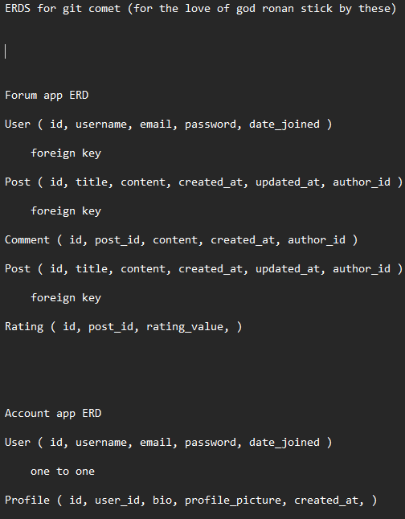
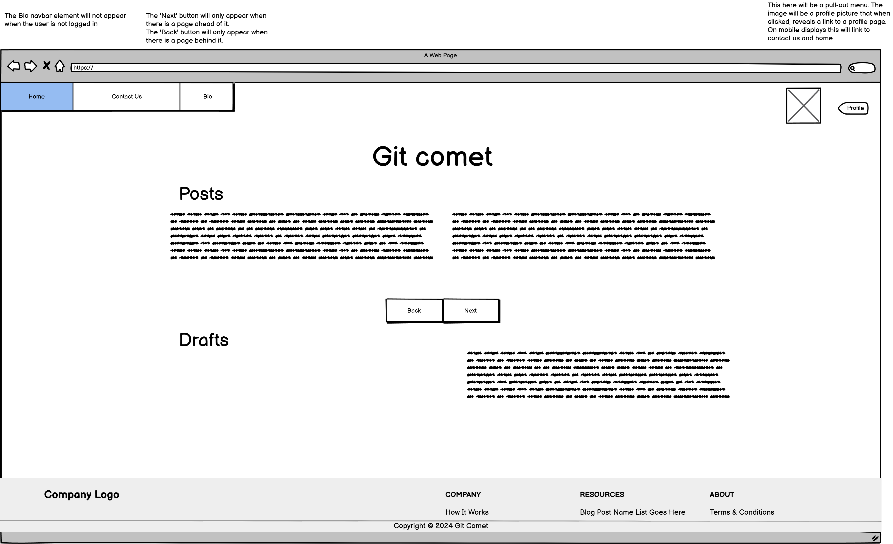
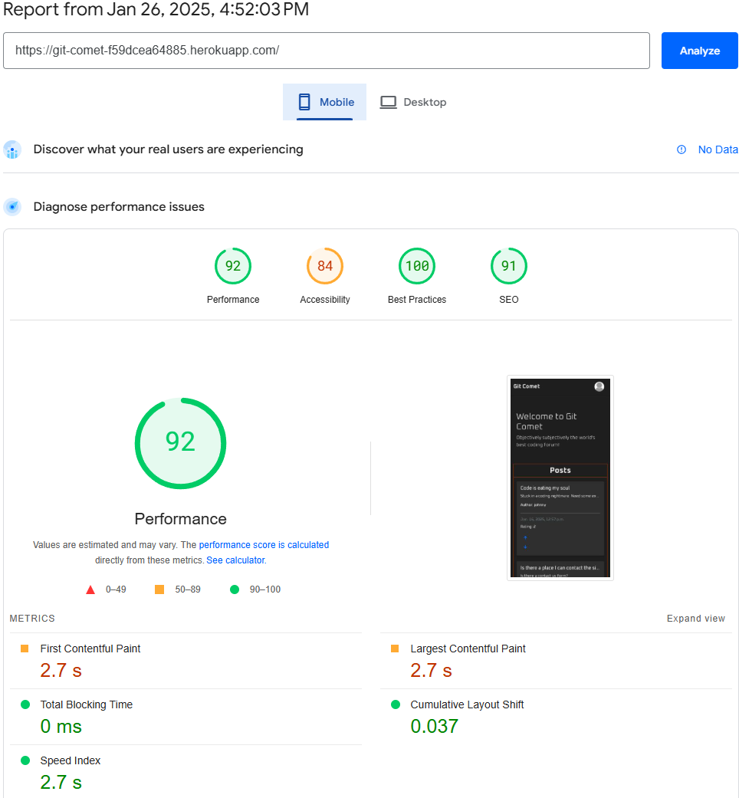
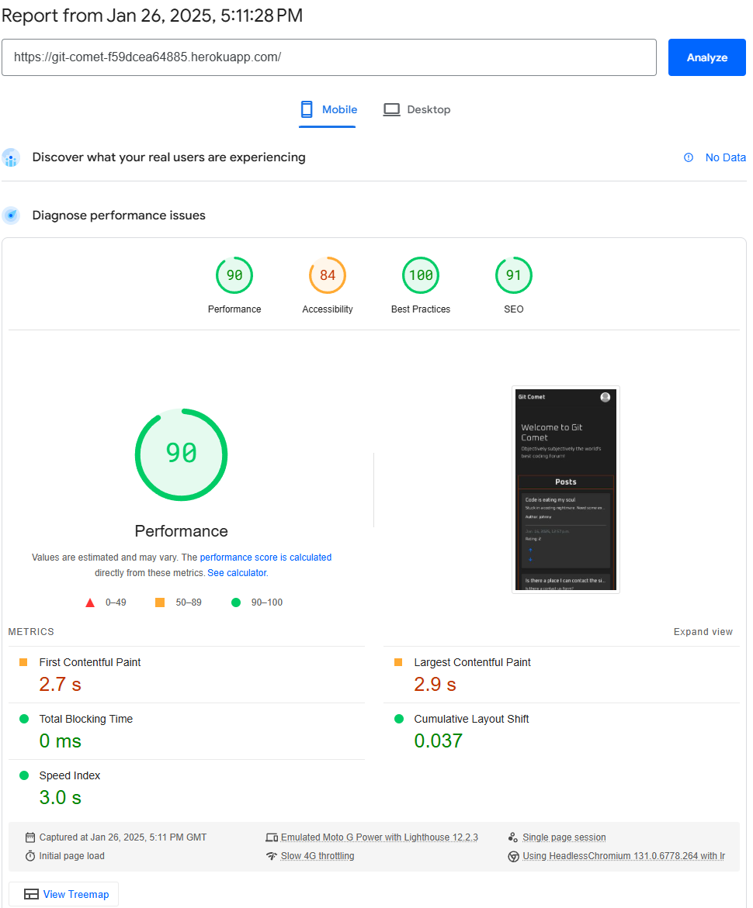
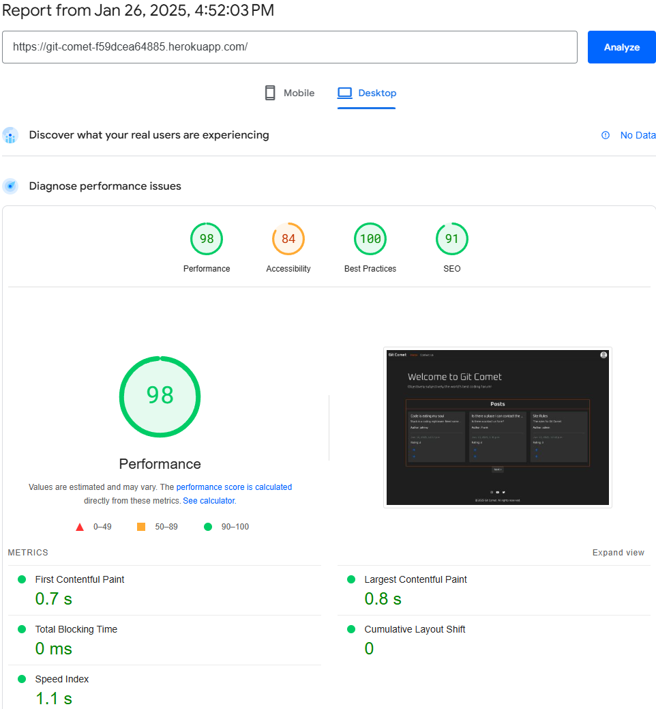
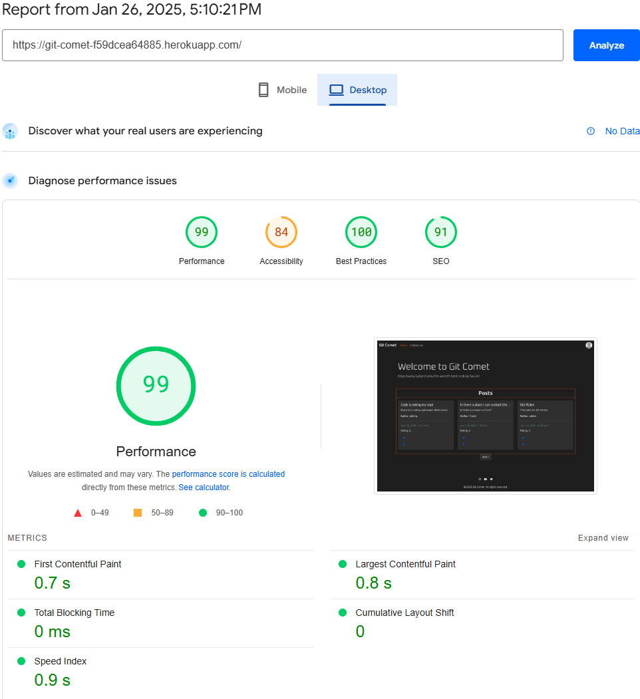
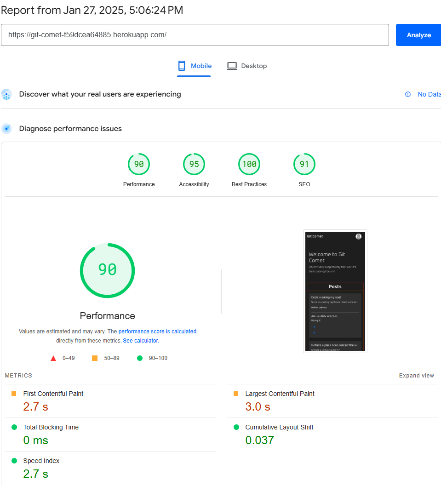
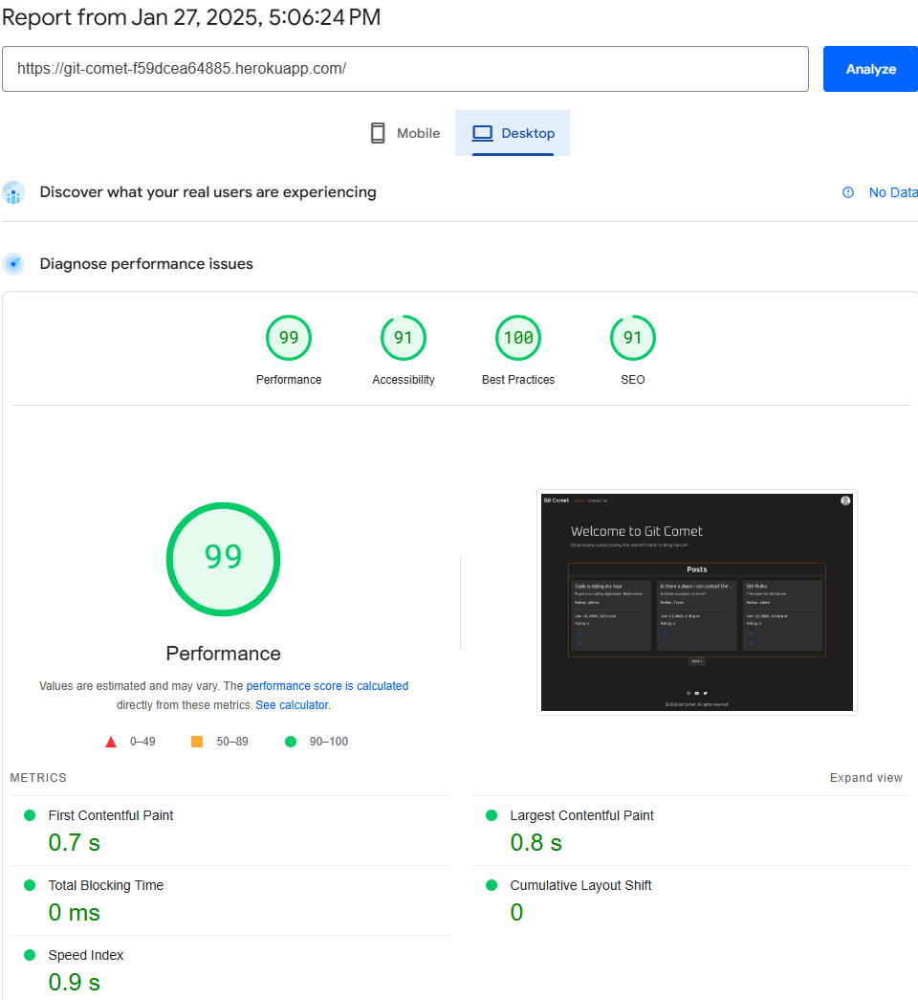
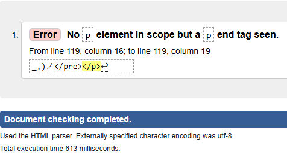
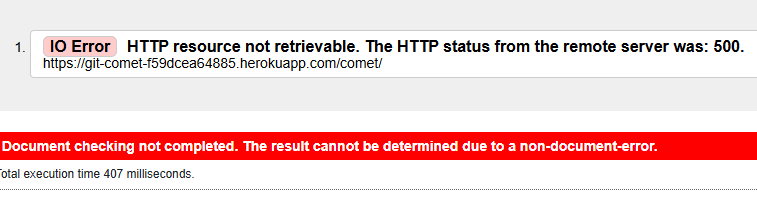

# Git Comet

Git Comet is a web forum built for coders to ask questions, make connections, or to simply chat.

## Entity Relationship Diagram

    

## Wireframes

    
    
    

- You may have noticed that the wireframes look quite a bit different than the finished site. This is due to my scope and MVP changing as development continued. The most glaring difference is the footer. I decided to use a minimalistic footer simply because I believe it fits the site better. You may have also noticed the lack of an About page. This is because I didn't see the need for an About page. Instead, I chose to have a Blog Post created by an Admin account act as one. I figured this was better for the user experience whilst also aligning with the sites purpose.

## Project Structure

The project is organized into several key directories and files:

- `account/`: Manages user accounts, including models, views, and admin configurations.
- `forum/`: Handles forum-related functionalities such as forms, views, and templates.
- `git_comet/`: The main Django application configuration, including settings and URLs.
- `static/` and `staticfiles/`: Contains static assets like CSS and JavaScript files.
- `templates/`: Stores HTML templates for rendering views.
- `manage.py`: A command-line utility for administrative tasks.
- `requirements.txt`: Lists the Python dependencies for the project.
- `Procfile`: Specifies the commands to run the application on Heroku.
- `README.md`: You're reading this right now. Hello! 👋

## Technologies Used

- **Django**
- **Heroku**
- **Gitpod**
- **Code Institute Template**
- **Code Institute Database**
- **Visual Studio Code**
- **Copilot**

## Features Implemented

1. **User Authentication**: Not done quite yet. Hopefully on the next commit.
2. **Forum**: Created a forum where users can post topics and will eventually be able to comment on posts.
3. **Admin Interface**: Customized the Django admin interface to manage user accounts and forum posts.
4. **Static Files Management**: Configured the handling of static files.
5. **Deployment**: Set up deployment configurations for Heroku, such as the `Procfile`, `runtime.txt`, and numerous Heroku config vars that I will detail on a later commit as I can't sign into Heroku, reason being, Google Authenticator decided it's going to feed me incorrect codes. Thanks Google.
6. **Ratings**: Implemented a rating system that allows users to rate posts. This feature strengthens community engagement and encourages users to create accounts.
7. **Draft and Update Posts**: Added the ability for users to save drafts and update their posts. This feature allows users to refine their content before publishing and keep their posts up-to-date.
8. **Profile Picture**: Enabled users to choose from a selection of three profile pictures. This feature provides users with an extra bit of customization.
9. **Bio**: Added a bio feature that allows users to create and update a personal biography on their profile. This adds a personal touch to user profiles and helps build a sense of community.
10. **Contact Us**: Created a Contact Us page that provides users with a way to reach out to the site administrators for support, feedback, or inquiries. This feature is essential for maintaining open communication with the user base.

### Purpose Behind Features

- **User Authentication**: The purpose of adding user authentication is to ensure that users can securely log in and manage their accounts. It was essential that users were given the option to change their username, email address, and password. This feature also lays the groundwork for future enhancements, such as personalized content and user-specific settings.
- **Forum**: The main forum allows users to create and participate in discussions. This is the core functionality of Git Comet, enabling coders to ask questions, share knowledge, and connect with others in the community. The forum allows for signed-in users to make posts of their own, or rate and comment on other users' posts. This interaction fosters a collaborative environment where users can learn from each other and build professional relationships.
- **Ratings**: Ratings synergize extremely well with the main forum page. When this site was just an idea, a rating system was my favorite feature. The reason behind this, not only to strengthen community engagement and further encourage users to create accounts, but also because it was the first time I had ever attempted something of the sort. Ratings help highlight valuable content and give users a sense of accomplishment when their posts are well-received.
- **Admin Interface**: Customizing the Django admin interface helps administrators manage user accounts and forum posts more efficiently. It provides a user-friendly way to oversee the site's content and user interactions. This is required for any social platform to ensure that the community guidelines are followed and to manage any inappropriate content or user behavior.
- **Profile Picture**: A signed-in user can choose from a selection of three profile pictures. Profile pictures provide users with that extra bit of customization that was my goal for Git Comet. This feature helps users express their individuality and makes the platform feel more personalized.
- **Draft and Update Posts**: The ability to save drafts and update posts allows users to work on their posts over time and make changes as needed. This feature ensures that users can refine their content before publishing and keep their posts up-to-date with new information. It also reduces the pressure on users to finalize their posts in one sitting, leading to higher quality content.
- **Contact Us**: The Contact Us page provides users with a way to reach out to the site administrators for support, feedback, or inquiries. This feature is essential for maintaining open communication with the user base and addressing any issues or suggestions they may have. It helps build trust and shows that the administrators are approachable and responsive to user needs.
- **Bio**: The Bio feature allows users to create and update a personal biography on their profile. This adds a personal touch to user profiles and helps build a sense of community by allowing users to share more about themselves. It encourages users to connect on a more personal level and fosters a sense of belonging within the community.

## How I've Used Copilot

GitHub Copilot has been an invaluable tool throughout the development of Git Comet. However, on many occassions, Copilot has provided me with incorrect code, used techniques I'm not familiar with, and many more small issues. Despite this, I've used Copilot to great effect. Here are some of the ways Copilot has assisted me in building this project.

1. **Code Suggestions**: Copilot has provided code suggestions, helping me write code faster. It has been particularly useful for generating boilerplate code, repetitive tasks, and project wide changes (such as renaming a file).
2. **Documentation**: Copilot has assisted in writing this readme file. I wrote the content, whilst Copilot formatted it so that it doesn't look like a lunatics notepad document. Copilot has also provided me with very useful and surprisingly accurate commit messages. If only it was this accurate with its code.
3. **Debugging**: By suggesting potential fixes and improvements, Copilot has helped me debug issues more efficiently. It has provided insights into best practices and alternative approaches to solving problems.
4. **Learning**: Copilot has served as a learning tool, offering explanations and examples for various coding concepts and libraries. This has been especially helpful when working with new technologies or unfamiliar code it would often try to use.

Overall, GitHub Copilot has significantly enhanced my productivity and in some cases, the quality of my code. It has been like having an exceptionally smart (but also arrogant) person to talk to. Although it has been adamant I add code which clearly will not work, it's tried its best.

## Deployment

### Lighthouse Scores

- **Lighthouse**: My first lighthouse test was extremely motivating. For mobile, I had a performance score of 92, accessibility score of 82, Best Practices score of 100, and an SEO score of 91. The desktop score was identical aside from performance which was at 98. I'm very happy with these results. Eventually, I began experimenting with further optimisations to increase site performance for mobile and desktop devices. Copilot suggested that I create two new JavaScript files, one for Critical JS, and the other for Non Critical JS. It also reccomended that I move critical CSS into base.html. After applying these, I deployed the site and tested it again, only to discover the sites JavaScript, certain CSS elements, and certain pages were completely broken. The only positive was a 1% improvement in desktop performance. For such a miniscule performance gain, I decided against applying these changes, and reverted to a previous version. The test at 4:52PM is test 1, and the test at 5:10PM/5:11PM is test 2.

    
    

    
    

- In response to the high, but still not satisfactory accessibility score of 82, I made further improvements to the site. The two largest issues the lighthouse test had regarding my sites accessibility was the colour of some text elements, it was deemed too similar to the background, hence unreadable. However, I have tested this myself using multiple people, viewing the site on two of the most common display types, OLED, and LCD. The purpose of this was to see if this was an issue that an actual living breathing human being might encounter. Once I had finished my little experiment using family and friends as guinea pigs, I came to the conclusion that the text was visible on all display types in every condition aside from LCD displays whilst outside. Despite this being a minority, I decided to change the text colour anyway, as despite the very particular conditions, it was still an issue that would effect a portion of the user base. This improved the sites accessibility score massively. It now rests at a score of 95.

    
    

- Although the mobile performance score dropped by 2, I am more than comfortable sacrificing such a small amount of performance in favour for a more accessible and responsive site. Overall, I'm immensely impressed with these scores.

### W3C Validation

- **W3C**: Throughout development, I had consciously been optimising my code ensuring that it was valid HTML5. Due to this, when it came time to do my first W3C validation test, I only had two errors, both on different sites. One error was seemingly a Heroku error (surprise surprise) as the validator could not connect to the page. The second error is seemingly unavoidable,as from what I can tell, the validator itself is incorrect. The error claims that there's _No p element in scope but a p end tag seen_, yet when checking the page source code at the line and column listed, this issue isn't present.

    
    

- Despite these frustrations, I'm extremely happy with both the Lighthouse Scores, and the W3C Validation.

### Major Issues

- **Heroku**: The amount of issues I had deploying to Heroku is incredible. I must have jinxed myself early on in development as I had seen my colleagues have constant issues with Heroku, while I was sat there thinking "Oh god. Something bad is going to happen any minute now and it'll take ages to fix." and as I expected. It happened. To be completely honest, I have no idea what issue Heroku had with my project. I was getting errors relating to code which was 200% correct and working, whilst intentionally sabotaged code wasn't even mentioned in the error logs. Where my local server ran, the Heroku server crashed and burned, then flipped over, and exploded. With Heroku Test Deployment 10, the site began working again. I have no idea why. My best guess is Heroku servers operate under the "If it ain't broke, find an excuse as to why it's broke" philosophy

- **Profile Pictures**: Originally, my idea for Git Comet users to change their profile picture allowed users to upload custom images from their local machine to the site. However, I soon discovered that this was easier said than done, as not only was the implementation of this feature causing issues with HTML validation and site performances, but the JavaScript needed for a drag and drop system was proving to be time consuming and incompatible with many site elements. There was also the issue with accessibility, as the dropdown menu, one of the core functions of Git Comet, may blend into the background too well if the uploaded image was too similar to the sites colour scheme. Due to this, I altered the idea and settled on a preset list of profile pictures a signed in user can choose between.

### Bug Fixes

- Duplicate ratings.
- Ratings not properly applying.
- Deleted comments instead being duplicated.
- Drafted posts unable to be published.
- Profile pictures not displaying correctly.
- Incorrect timestamps on posts.
- Incorrect timestamps on comments.
- Post posting despite having no title.
- Post posting despite having no excerpt.
- Post posting despite slug not being unique
- Comment posting despite having no content.
- User authentication errors.
- Broken links in the navigation bar.
- CSS not loading on certain pages.
- JavaScript errors causing buttons to malfunction.
- Form validation issues.
- Inconsistent styling across different browsers.
- Slow page load times. (Particularly when viewing an enlarged post)
- Missing alt text on images.
- Pagination not working on the forum page.
- User profile updates not saving.
- Error messages not displaying correctly.
- Mobile responsiveness issues.
- Inconsistent font sizes.
- Misaligned elements on the page.
- Session timeouts occurring too frequently.
- Incorrect error handling on forms.
- Footer links not working.
- Profile bio text not wrapping correctly.
- Comment section not updating in real-time.
- Issues with user logout functionality.
- Problems with post editing permissions.
- Issues with form submission on mobile devices.
- Problems with user registration process.
- Strange visual artifacts on mobile devices.
- Dropdown menu opening horizontally instead of vertically.
- Inconsistent post card sizes.
- Issues with user content deleting.
- Issues with user content editing.
- Contact Us form not being submitted.
- Timed modal for users without an account not appearing.
- Issues with update profile form styling.
- Update profile form not applying.
- Comments containing over 140 characters becoming unreadable on mobile devices.
- Posts containing over 140 characters becoming unreadable on mobile devices.
- Post authors not being able to downvote their own post.
- Many small code adjustments to improve site performance.